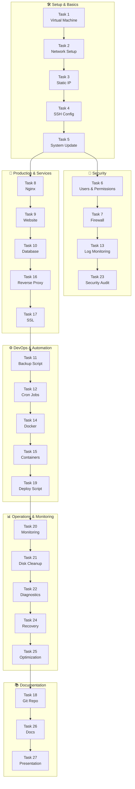

# 🖥️ Linux Server Administration — Task Tracker

> **პროექტი:** Ubuntu Server Setup & Administration  
> **დაწყების თარიღი:** 02.10.26  
> **ბოლო განახლება:** 

---

## სტატუსის ლეგენდა

| სიმბოლო | სტატუსი |
|---------|---------|
| ✅ | შესრულებულია |
| 🔄 | მიმდინარეობს |
| ⏳ | დაგეგმილია |
| ⚠️ | პრობლემაა |

---
## დიაგრამა




## 📋 ამოცანები

### ბლოკი 1 — საბაზისო Setup (Tasks 1–9)

| # | ამოცანა | სტატუსი | შენიშვნა |
|---|---------|---------|----------|
| 1 | **Virtual Machine** — Ubuntu Server VirtualBox-ში | ✅ | |
| 2 | **Network Setup** — NAT + Host-Only adapters | ✅ | |
| 3 | **Static IP Configuration** — Host-Only static IP | ✅ | |
| 4 | **SSH Configuration** — SSH key authentication | ✅ | |
| 5 | **System Update** — git, curl, vim, htop, net-tools | ✅ | |
| 6 | **User & Permission Management** — developer + deploy users | ✅ | |
| 7 | **Firewall Setup** — ufw: SSH, HTTP, HTTPS | ✅ | |
| 8 | **Web Server Installation** — Nginx | ✅ | |
| 9 | **Custom Website Deploy** — HTML site on Nginx | ✅ | |

### ბლოკი 2 — Database & Automation (Tasks 10–13)

| # | ამოცანა | სტატუსი | შენიშვნა |
|---|---------|---------|----------|
| 10 | **Database Installation** — MySQL/PostgreSQL + user | ✅ | |
| 11 | **Automated Backup Script** — bash script, tar.gz | ✅ | |
| 12 | **Cron Automation** — daily backup 3:00 AM | ✅ | |
| 13 | **Log Monitoring** — failed logins + sudo commands | ✅ | |

### ბლოკი 3 — Docker & Deployment (Tasks 14–19)

| # | ამოცანა | სტატუსი | შენიშვნა |
|---|---------|---------|----------|
| 14 | **Docker Installation** — Docker + Docker Compose | ✅ | |
| 15 | **Containerized Application** — nginx + db compose | ✅ | |
| 16 | **Reverse Proxy Configuration** — Nginx → Docker | ✅ | |
| 17 | **SSL Certificate** — self-signed, HTTPS | ✅ | |
| 18 | **Git Repository Setup** — initial commit | ✅ | |
| 19 | **Deployment Script** — git pull → rebuild → restart | ✅ | |

### ბლოკი 4 — Monitoring & Optimization (Tasks 20–25)

| # | ამოცანა | სტატუსი | შენიშვნა |
|---|---------|---------|----------|
| 20 | **System Resource Monitoring** — htop/glances/netdata | ✅ | |
| 21 | **Disk Space Management** — cleanup 30+ day files | ✅ | |
| 22 | **Network Diagnostics** — ports, connections | ✅ | |
| 23 | **Security Audit** — users, sudo, fail2ban | ✅ | |
| 24 | **Disaster Recovery Test** — full backup → restore | ✅ | |
| 25 | **Performance Optimization** — disable services, tune configs | ✅ | |

### ბლოკი 5 — Documentation (Task 26)

| # | ამოცანა | სტატუსი | შენიშვნა |
|---|---------|---------|----------|
| 26 | **Documentation** — სრული setup/backup/restore guide | 🔄 | |

---

## 📊 პროგრესი

- **შესრულებული:** 25 / 26
- **მიმდინარე:** 1 / 26
- **დარჩენილი:** 1 / 26

---

## 📝 შენიშვნები და სამახსოვრო

> აქ ჩაწერე ყველაფერი რაც გინდა დაიმახსოვრო — ბრძანებები, IP მისამართები, პაროლები (ადგილობრივად), კონფიგურაციის დეტალები და ა.შ.

### 🔑 მნიშვნელოვანი ინფორმაცია

| პარამეტრი | მნიშვნელობა |
|-----------|-------------|
| VM IP (Host-Only) | |
| VM IP (NAT) | |
| SSH Port | 22 |
| DB Type | PostgreSQL / MySQL |
| DB Name | |
| DB User | |
| Nginx Config Path | |
| Backup Script Path | |
| Docker Compose Path | |
| SSL Cert Path | |
| Git Repo Path | |

### 🗒️ ზოგადი შენიშვნები

-  

### ⚠️ ცნობილი პრობლემები / გასაკეთებელი

-  

### 💡 სასარგებლო ბრძანებები

```bash
# სწრაფი ჩანაწერებისთვის
```

---

*ბოლოს განახლდა: ____-__-__*