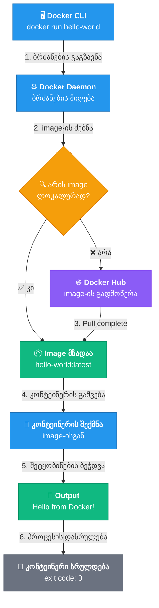

# 🚀 Task 14 — Docker Installation

---

## 📦 საჭირო პაკეტები
პირველ რიგში, განვაახლოთ პაკეტების სია და დავაყენოთ 
საჭირო დამოკიდებულებები:

```bash
sudo apt update
```
```bash
sudo apt install ca-certificates curl gnupg -y
```


| პაკეტი | დანიშნულება |
|--------|-------------|
| `ca-certificates` | SSL სერტიფიკატების ნდობის ჯაჭვი — საჭიროა HTTPS კავშირებისთვის |
| `curl` | URL-ებიდან მონაცემების გადმოწერა |
| `gnupg` | GPG გასაღებების მართვა — რეპოზიტორიის ავთენტიფიკაციისთვის |


## 🔐 Docker-ის ოფიციალური რეპოზიტორიის დამატება

### GPG გასაღების იმპორტი

Docker-ის პაკეტების ნამდვილობის შესამოწმებლად საჭიროა მათი GPG გასაღები:

```bash
sudo install -m 0755 -d /etc/apt/keyrings

curl -fsSL https://download.docker.com/linux/ubuntu/gpg | \
sudo gpg --dearmor -o /etc/apt/keyrings/docker.gpg
```

```bash
sudo chmod a+r /etc/apt/keyrings/docker.gpg
```
> 💡 `--dearmor` ფლაგი ტექსტურ GPG გასაღებს ბინარულ ფორმატში გარდაქმნის, რაც `apt`-ს სჭირდება.

### რეპოზიტორიის დამატება

```bash
echo "deb [arch=$(dpkg --print-architecture) signed-by=/etc/apt/keyrings/docker.gpg] \
https://download.docker.com/linux/ubuntu \
$(. /etc/os-release && echo "$VERSION_CODENAME") stable" | \
sudo tee /etc/apt/sources.list.d/docker.list > /dev/null
```

ეს ბრძანება ავტომატურად ამოიცნობს სისტემის არქიტექტურას (`amd64`) და Ubuntu-ს ვერსიას (`noble`), შემდეგ კი შესაბამის რეპოზიტორიას დაამატებს.


🐳 Docker-ის ინსტალაცია

განვაახლოთ პაკეტების სია (ახალი რეპოზიტორიის ჩათვლით) და დავაყენოთ Docker:


```bash
sudo apt update
```

```bash
sudo apt install docker-ce docker-ce-cli containerd.io \
docker-buildx-plugin docker-compose-plugin -y
```


რა დაინსტალირდება:

| პაკეტი | დანიშნულება |
|--------|-------------|
| `docker-ce` | Docker Engine — ძირითადი სერვისი (daemon) |
| `docker-ce-cli` | Docker CLI — ბრძანებების ხაზის ინტერფეისი |
| `containerd.io` | კონტეინერების runtime — Docker-ის „ძრავი" |
| `docker-buildx-plugin` | გაფართოებული build შესაძლებლობები (multi-platform) |
| `docker-compose-plugin` | Docker Compose v2 — მრავალკონტეინერიანი აპლიკაციების მართვა |

## 📋 ინსტალაციის პროცესი (Output)

```console
k@devserver:~$ sudo apt install docker-ce docker-ce-cli containerd.io docker-buildx-plugin docker-compose-plugin -y
Reading package lists... Done
Building dependency tree... Done
Reading state information... Done
The following additional packages will be installed:
  docker-ce-rootless-extras libslirp0 pigz slirp4netns
Suggested packages:
  cgroupfs-mount | cgroup-lite docker-model-plugin
The following NEW packages will be installed:
  containerd.io docker-buildx-plugin docker-ce docker-ce-cli docker-ce-rootless-extras docker-compose-plugin libslirp0 pigz slirp4netns
0 upgraded, 9 newly installed, 0 to remove and 2 not upgraded.
Need to get 96.7 MB of archives.
After this operation, 391 MB of additional disk space will be used.
Get:1 http://ge.archive.ubuntu.com/ubuntu noble/universe amd64 pigz amd64 2.8-1 [65.6 kB]
Get:2 https://download.docker.com/linux/ubuntu noble/stable amd64 containerd.io amd64 2.2.1-1~ubuntu.24.04~noble [23.4 MB]
Get:3 http://ge.archive.ubuntu.com/ubuntu noble/main amd64 libslirp0 amd64 4.7.0-1ubuntu3 [63.8 kB]
Get:4 http://ge.archive.ubuntu.com/ubuntu noble/universe amd64 slirp4netns amd64 1.2.1-1build2 [34.9 kB]
Get:5 https://download.docker.com/linux/ubuntu noble/stable amd64 docker-ce-cli amd64 5:29.2.1-1~ubuntu.24.04~noble [16.3 MB]
Get:6 https://download.docker.com/linux/ubuntu noble/stable amd64 docker-ce amd64 5:29.2.1-1~ubuntu.24.04~noble [22.5 MB]
Get:7 https://download.docker.com/linux/ubuntu noble/stable amd64 docker-buildx-plugin amd64 0.31.1-1~ubuntu.24.04~noble [20.3 MB]
Get:8 https://download.docker.com/linux/ubuntu noble/stable amd64 docker-ce-rootless-extras amd64 5:29.2.1-1~ubuntu.24.04~noble [6,387 kB]
Get:9 https://download.docker.com/linux/ubuntu noble/stable amd64 docker-compose-plugin amd64 5.0.2-1~ubuntu.24.04~noble [7,721 kB]
Fetched 96.7 MB in 14s (7,017 kB/s)
Selecting previously unselected package containerd.io.
(Reading database ... 89575 files and directories currently installed.)
Preparing to unpack ...
...
No VM guests are running outdated hypervisor (qemu) binaries on this host.
```

## 👤 User-ის დამატება Docker Group-ში


ნაგულისხმევად, Docker მოითხოვს `sudo`-ს. იმისათვის რომ ჩვეულებრივმა მომხმარებელმა Docker-ის ბრძანებები `sudo`-ს გარეშე გაუშვას, საჭიროა მისი `docker` ჯგუფში დამატება:

sodu-ს გარეშე მუშაობისთვის:
```bash
sudo usermod -aG docker $USER
```
> ⚠️ **მნიშვნელოვანი:** ცვლილებები ძალაში შესვლისთვის საჭიროა ახალი სესიის დაწყება. ორი გზა არსებობს:


**ვარიანტი A** — მიმდინარე ტერმინალში:
```bash
newgrp docker
```

**ვარიანტი B** — სრული სესიის განახლება (უფრო საიმედო):
```bash
# გამოხვალ და თავიდან შეხვალ
exit
# ხელახლა SSH კავშირი
```

## ინსტალაციის შემოწმება


### ✅ შემოწმება (sudo-ს გარეშე)


```bash
docker --version
```
```
Docker version 29.2.1, build a5c7197
```

```bash
docker compose version
```
```
Docker Compose version v5.0.2
```

```console
k@devserver:~$ docker --version
Docker version 29.2.1, build a5c7197

k@devserver:~$ docker compose version
Docker Compose version v5.0.2
```

## 🧪 ტესტი — hello-world

Docker-ის სრული ფუნქციონალობის შესამოწმებლად გავუშვათ სატესტო კონტეინერი:

```bash
docker run hello-world
```


```console
Unable to find image 'hello-world:latest' locally
latest: Pulling from library/hello-world
17eec7bbc9d7: Pull complete
ea52d2000f90: Download complete
Digest: sha256:05813aedc15fb7b4d732e1be879d3252c1c9c25d885824f6295cab4538cb85cd
Status: Downloaded newer image for hello-world:latest

Hello from Docker!
This message shows that your installation appears to be working correctly.

```

> ✅ თუ ეს შეტყობინება გამოჩნდა — Docker სწორად არის დაინსტალირებული და მუშაობს `sudo`-ს გარეშე.


## 📖 დამატებითი ინფორმაცია

## როგორ მუშაობს hello-world კულისებს მიღმა



1. **Docker CLI** უგზავნის ბრძანებას Docker Daemon-ს
2. **Daemon** ეძებს `hello-world` image-ს ლოკალურად — ვერ პოულობს
3. **Daemon** გადმოწერს image-ს Docker Hub-იდან
4. **Daemon** ქმნის კონტეინერს ამ image-ისგან და უშვებს
5. კონტეინერი ბეჭდავს შეტყობინებას და სრულდება

---

## 📎 სასარგებლო ბმულები

- [Docker Hub](https://hub.docker.com/) — კონტეინერების image-ების რეგისტრი
- [Docker Documentation](https://docs.docker.com/get-started/) — ოფიციალური დოკუმენტაცია
- [Docker Compose Docs](https://docs.docker.com/compose/) — Compose-ის გზამკვლევი

