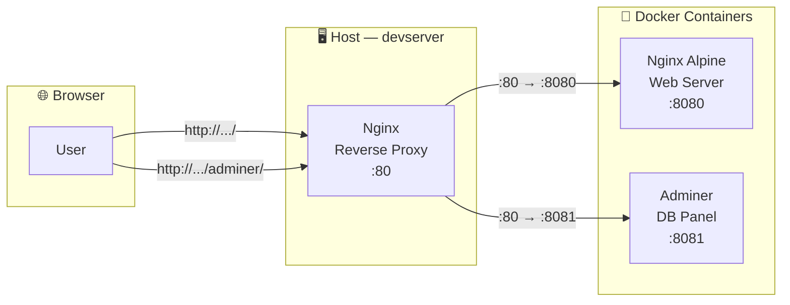

Task 16 — Reverse Proxy Configuration


## არქიტექტურა


ამ Task-მდე მომხმარებელს პორტის მითითება უწევდა (http://...:8080, http://...:8081). Reverse proxy-ით ყველაფერი სტანდარტულ 80 პორტზე ხელმისაწვდომია — URL path-ით განსხვავდება.

## წინაპირობა

Docker app უნდა იყოს გაშვებული:
```bash
cd ~/docker-app
docker compose ps
```
```console
NAME                   IMAGE                SERVICE   STATUS                   PORTS
docker-app-adminer-1   adminer:latest       adminer   Up 19 minutes            0.0.0.0:8081->8080/tcp
docker-app-db-1        postgres:16-alpine   db        Up 19 minutes (healthy)  5432/tcp
docker-app-web-1       nginx:alpine         web       Up 19 minutes            0.0.0.0:8080->80/tcp
```


> ✅ სამივე სერვისი `Up` სტატუსშია — შეგვიძლია გავაგრძელოთ.


## Reverse Proxy კონფიგურაციის შექმნა


ეს არის Host-ის Nginx-ის კონფიგურაცია (არა Docker-ის შიგნით არსებული Nginx-ის). Host-ის Nginx იღებს მოთხოვნებს 80 პორტზე და გადამისამართებს შესაბამის Docker კონტეინერზე.

```bash
sudo nano /etc/nginx/sites-available/docker-proxy
```


```nginx
server {
    listen 80;
    server_name _;

    location / {
        proxy_pass http://127.0.0.1:8080;
        proxy_set_header Host $host;
        proxy_set_header X-Real-IP $remote_addr;
        proxy_set_header X-Forwarded-For $proxy_add_x_forwarded_for;
        proxy_set_header X-Forwarded-Proto $scheme;
    }

    location /adminer/ {
        proxy_pass http://127.0.0.1:8081/;
        proxy_set_header Host $host;
        proxy_set_header X-Real-IP $remote_addr;
        proxy_set_header X-Forwarded-For $proxy_add_x_forwarded_for;
    }
}
```


### კონფიგურაციის განმარტება

**`server_name _;`** — ნებისმიერ hostname-ზე მოსულ მოთხოვნას დაამუშავებს (wildcard).

**`location /`** — მთავარ გვერდზე მოსული მოთხოვნა გადამისამართდება Docker-ის Nginx კონტეინერზე (`127.0.0.1:8080`).

**`location /adminer/`** — `/adminer/` path-ით მოსული მოთხოვნა გადამისამართდება Adminer კონტეინერზე (`127.0.0.1:8081`).

**`proxy_set_header` ჰედერები:**

| ჰედერი | დანიშნულება |
|--------|-------------|
| `Host` | ორიგინალი hostname გადაეცემა backend-ს |
| `X-Real-IP` | კლიენტის რეალური IP (არა proxy-ის) |
| `X-Forwarded-For` | მოთხოვნის მთელი გზა (proxy chain) |
| `X-Forwarded-Proto` | ორიგინალი პროტოკოლი (http/https) |

> 💡 **proxy_pass-ში trailing slash-ის მნიშვნელობა:** `http://127.0.0.1:8081/` (slash-ით) ნიშნავს რომ `/adminer/page` გადამისამართდება როგორც `/page` — ანუ path prefix-ი მოიჭრება. ეს Adminer-ის სწორად მუშაობისთვის აუცილებელია.


## საიტის ჩართვა

ძველი default კონფიგურაციის წაშლა და ახალის ჩართვა symbolic link-ით:

```bash
sudo rm /etc/nginx/sites-enabled/default
```
```bash
sudo ln -s /etc/nginx/sites-available/docker-proxy /etc/nginx/sites-enabled/
```

> 💡 Nginx-ის `sites-available` / `sites-enabled` სტრუქტურა Debian/Ubuntu-ს სპეციფიკაა. `sites-available`-ში ინახება ყველა კონფიგურაცია, `sites-enabled`-ში კი symlink-ები — მხოლოდ აქტიური საიტების.

---


## კონფიგურაციის შემოწმება და გამოყენება

ჯერ ვამოწმებთ სინტაქსს:

```bash
sudo nginx -t
```

```
nginx: the configuration file /etc/nginx/nginx.conf syntax is ok
nginx: configuration file /etc/nginx/nginx.conf test is successful
```

შემდეგ ვრესტარტავთ Nginx-ს:

```bash
sudo systemctl restart nginx
```

> ⚠️ **ყოველთვის გაუშვით `nginx -t` რესტარტამდე.** თუ კონფიგურაციაში შეცდომაა და პირდაპირ `restart`-ს გააკეთებთ, Nginx ვერ ჩაირთვება და საიტი დაეცემა.

```console
k@devserver:~/docker-app$ sudo nginx -t
nginx: the configuration file /etc/nginx/nginx.conf syntax is ok
nginx: configuration file /etc/nginx/nginx.conf test is successful
```


Nginx-ის გადატვირთვა
```bash
sudo systemctl restart nginx
```

Docker app რომ გაშვებულია, შეამოწმე:
```bash
bashcd ~/docker-app
docker compose ps
```

```console
k@devserver:~/docker-app$ cd ~/docker-app
k@devserver:~/docker-app$ docker compose ps
NAME                   IMAGE                COMMAND                  SERVICE   CREATED          STATUS                    PORTS
docker-app-adminer-1   adminer:latest       "entrypoint.sh docke…"   adminer   19 minutes ago   Up 19 minutes             0.0.0.0:8081->8080/tcp, [::]:8081->8080/tcp
docker-app-db-1        postgres:16-alpine   "docker-entrypoint.s…"   db        19 minutes ago   Up 19 minutes (healthy)   5432/tcp
docker-app-web-1       nginx:alpine         "/docker-entrypoint.…"   web       19 minutes ago   Up 19 minutes             0.0.0.0:8080->80/tcp, [::]:8080->80/tcp
k@devserver:~/docker-app$
```

Terminal-იდან (curl)

```bash
curl http://localhost
```

```html
<!DOCTYPE html>
<html lang="ka">
<head>
    <meta charset="UTF-8">
    <meta name="viewport" content="width=device-width, initial-scale=1.0">
    <title>Docker App</title>
    <style>
        * { margin: 0; padding: 0; box-sizing: border-box; }
        body {
            font-family: 'Segoe UI', sans-serif;
            background: #0f172a;
            color: #e2e8f0;
            min-height: 100vh;
            display: flex;
            align-items: center;
            justify-content: center;
        }
        .card {
            background: #1e293b;
            border-radius: 16px;
            padding: 2.5rem;
            max-width: 500px;
            width: 90%;
            box-shadow: 0 20px 60px rgba(0,0,0,0.5);
            text-align: center;
        }
        h1 { font-size: 1.8rem; margin-bottom: 0.5rem; }
        .emoji { font-size: 3rem; margin-bottom: 1rem; }
        .services {
            margin: 1.5rem 0;
            text-align: left;
        }
        .service {
            display: flex;
            align-items: center;
            gap: 0.75rem;
            padding: 0.8rem 1rem;
            margin: 0.5rem 0;
            background: #0f172a;
            border-radius: 10px;
        }
        .dot {
            width: 12px; height: 12px;
            background: #22c55e;
            border-radius: 50%;
            box-shadow: 0 0 8px rgba(34,197,94,0.5);
        }
        .btn {
            display: inline-block;
            margin-top: 1.5rem;
            padding: 0.7rem 1.5rem;
            background: #3b82f6;
            color: #fff;
            text-decoration: none;
            border-radius: 10px;
            font-weight: 600;
            transition: background 0.2s;
        }
        .btn:hover { background: #2563eb; }
        .footer { margin-top: 1.5rem; font-size: 0.8rem; color: #64748b; }
    </style>
</head>
<body>
    <div class="card">
        <div class="emoji">🐳</div>
        <h1>Docker App Running!</h1>
        <p>Nginx + PostgreSQL + Adminer</p>

        <div class="services">
            <div class="service">
                <div class="dot"></div>
                <span><strong>Nginx</strong> — Web Server (port 8080)</span>
            </div>
            <div class="service">
                <div class="dot"></div>
                <span><strong>PostgreSQL 16</strong> — Database</span>
            </div>
            <div class="service">
                <div class="dot"></div>
                <span><strong>Adminer</strong> — DB Management</span>
            </div>
        </div>

        <a href="/adminer/" class="btn">Open Adminer (DB Panel)</a>

        <div class="footer">
            Task 15 — Containerized Application ✅
        </div>
    </div>
</body>
</html>

```

> ✅ 80 პორტზე მოთხოვნამ Docker-ის Nginx კონტეინერიდან (8080) დააბრუნა HTML გვერდი.

### Browser-იდან

| URL | შედეგი |
|-----|--------|
| `http://192.168.56.101/` | Docker web app-ის გვერდი |
| `http://192.168.56.101/adminer/` | Adminer DB მართვის პანელი |

> ✅ ორივე მუშაობს სტანდარტულ 80 პორტზე — პორტის მითითება აღარ არის საჭირო.

---


## Reverse Proxy-ის კონცეფცია

Reverse proxy არის სერვერი რომელიც კლიენტის მოთხოვნებს იღებს და უკანა (backend) სერვერ(ებ)ზე ანაწილებს. კლიენტი არ იცის backend-ების არსებობის შესახებ — მხოლოდ proxy-ს ხედავს.

### რატომ გვჭირდება

- **პორტების დამალვა** — მომხმარებელი აღარ ხედავს `:8080`, `:8081` პორტებს
- **ერთიანი წვდომის წერტილი** — ყველაფერი ერთ მისამართზე, URL path-ით განსხვავებით
- **უსაფრთხოება** — backend სერვისები მხოლოდ `127.0.0.1`-ზე უსმენენ, გარედან პირდაპირ მიუწვდომელია
- **მომავალში** — SSL/TLS termination, load balancing, caching ყველაფერი proxy-ის დონეზე კეთდება

### ორი Nginx-ის თანაარსებობა

ამ კონფიგურაციაში ორი Nginx მუშაობს — ეს ხშირად დამაბნეველია:

```
Host Nginx (:80)  →  Docker Nginx (:8080)  →  Static files
                  →  Adminer (:8081)       →  DB Panel
```

**Host-ის Nginx** — reverse proxy-ის როლში, მოთხოვნებს ანაწილებს. **Docker-ის Nginx** — web server-ის როლში, სტატიკურ ფაილებს ასერვირებს. პროდაქშენში ეს ორი ხშირად ერთდება ერთ Nginx-ში, მაგრამ სასწავლო მიზნით ცალ-ცალკე კარგად აჩვენებს proxy-ისა და web server-ის განსხვავებას.