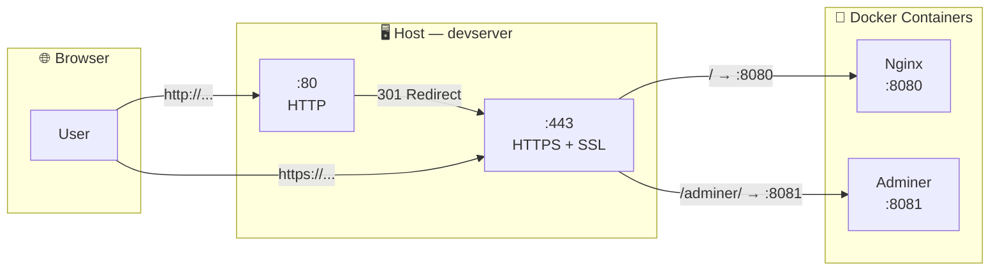

Task 17 — SSL Certificate

## არქიტექტურა



SSL სერტიფიკატის გენერაცია:
```bash
sudo mkdir -p /etc/nginx/ssl
```
```bash
sudo openssl req -x509 -nodes -days 365 -newkey rsa:2048 \
  -keyout /etc/nginx/ssl/server.key \
  -out /etc/nginx/ssl/server.crt \
  -subj "/C=GE/ST=Imereti/L=Kutaisi/O=DevServer/CN=devserver"
```

```console
k@devserver:~/docker-app$ sudo mkdir -p /etc/nginx/ssl
k@devserver:~/docker-app$ sudo openssl req -x509 -nodes -days 365 -newkey rsa:2048 \
  -keyout /etc/nginx/ssl/server.key \
  -out /etc/nginx/ssl/server.crt \
  -subj "/C=GE/ST=Imereti/L=Kutaisi/O=DevServer/CN=devserver"
...+...+.....+......+.+......+..+.
-----
k@devserver:~/docker-app$
```


### ბრძანების პარამეტრები

| პარამეტრი | დანიშნულება |
|-----------|-------------|
| `req -x509` | Self-signed სერტიფიკატის გენერაცია (არა CSR) |
| `-nodes` | Private key არ დაიშიფრდება პაროლით (No DES) |
| `-days 365` | სერტიფიკატი მოქმედებს 1 წელი |
| `-newkey rsa:2048` | ახალი 2048-bit RSA გასაღების გენერაცია |
| `-keyout` | Private key-ის შენახვის გზა |
| `-out` | სერტიფიკატის შენახვის გზა |
| `-subj` | სერტიფიკატის მეტამონაცემები (ქვეყანა, ქალაქი, ორგანიზაცია, hostname) |

შედეგად ორი ფაილი შეიქმნება:

| ფაილი | რა არის |
|-------|---------|
| `server.key` | Private key — საიდუმლო, არავის არ უნდა გაუზიაროთ |
| `server.crt` | სერტიფიკატი — საჯარო, კლიენტს გადაეცემა TLS handshake-ის დროს |

> 💡 **Self-signed vs CA-signed:** Self-signed სერტიფიკატი ბრაუზერში გაფრთხილებას აჩვენებს, რადგან არცერთი სანდო Certificate Authority (CA) არ ადასტურებს მის ნამდვილობას. პროდაქშენში Let's Encrypt-ის ან სხვა CA-ს სერტიფიკატი გამოიყენება. სასწავლო და development გარემოში self-signed სრულიად საკმარისია.


## Nginx კონფიგურაციის განახლება:

```bash
sudo nano /etc/nginx/sites-available/docker-proxy
```

```nginx
server {
    listen 80;
    server_name _;
    return 301 https://$host$request_uri;
}

server {
    listen 443 ssl;
    server_name _;

    ssl_certificate /etc/nginx/ssl/server.crt;
    ssl_certificate_key /etc/nginx/ssl/server.key;

    ssl_protocols TLSv1.2 TLSv1.3;
    ssl_ciphers HIGH:!aNULL:!MD5;

    location / {
        proxy_pass http://127.0.0.1:8080;
        proxy_set_header Host $host;
        proxy_set_header X-Real-IP $remote_addr;
        proxy_set_header X-Forwarded-For $proxy_add_x_forwarded_for;
        proxy_set_header X-Forwarded-Proto $scheme;
    }

    location /adminer/ {
        proxy_pass http://127.0.0.1:8081/;
        proxy_set_header Host $host;
        proxy_set_header X-Real-IP $remote_addr;
        proxy_set_header X-Forwarded-For $proxy_add_x_forwarded_for;
    }
}

```


შემოწმება და რესტარტი:

```bash
sudo nginx -t
```

```console
nginx: the configuration file /etc/nginx/nginx.conf syntax is ok
nginx: configuration file /etc/nginx/nginx.conf test is successful
k@devserver:~/docker-app$
```

```bash
sudo systemctl restart nginx
```

### კონფიგურაციის განმარტება

**პირველი `server` ბლოკი (HTTP → HTTPS redirect):**

`return 301 https://$host$request_uri;` — ნებისმიერი HTTP მოთხოვნა 301 (Permanent Redirect) სტატუსით გადამისამართდება HTTPS-ზე. `$host` და `$request_uri` ინარჩუნებს ორიგინალ მისამართს.

**მეორე `server` ბლოკი (HTTPS):**

| დირექტივა | დანიშნულება |
|-----------|-------------|
| `listen 443 ssl` | HTTPS პორტზე მოსმენა SSL-ით |
| `ssl_certificate` | სერტიფიკატის ფაილის გზა |
| `ssl_certificate_key` | Private key-ის ფაილის გზა |
| `ssl_protocols TLSv1.2 TLSv1.3` | მხოლოდ თანამედროვე, უსაფრთხო პროტოკოლები |
| `ssl_ciphers HIGH:!aNULL:!MD5` | ძლიერი შიფრები, სუსტების გამორიცხვა |

> 💡 `location` ბლოკები Task 16-იდან უცვლელია — reverse proxy ლოგიკა იგივე რჩება, უბრალოდ ახლა SSL-ის მიღმა მუშაობს.


## Firewall-ში HTTPS-ის დაშვება

443 პორტი (HTTPS) უნდა იყოს გახსნილი firewall-ში:

```bash
sudo ufw allow 'Nginx Full'
sudo ufw status
```

```
Status: active

To                         Action      From
--                         ------      ----
22/tcp                     ALLOW       Anywhere
80/tcp                     ALLOW       Anywhere
443                        ALLOW       Anywhere
Nginx Full                 ALLOW       Anywhere
...
```

> 💡 `Nginx Full` პროფილი ერთდროულად ხსნის 80 (HTTP) და 443 (HTTPS) პორტებს. ორივე საჭიროა — 80 redirect-ისთვის, 443 HTTPS ტრაფიკისთვის.

```console
k@devserver:~/docker-app$ sudo ufw allow 'Nginx Full'
Rule added
Rule added (v6)
k@devserver:~/docker-app$ sudo ufw status
Status: active

To                         Action      From
--                         ------      ----
22/tcp                     ALLOW       Anywhere
80/tcp                     ALLOW       Anywhere
443                        ALLOW       Anywhere
Nginx HTTP                 ALLOW       Anywhere
Nginx Full                 ALLOW       Anywhere
22/tcp (v6)                ALLOW       Anywhere (v6)
80/tcp (v6)                ALLOW       Anywhere (v6)
443 (v6)                   ALLOW       Anywhere (v6)
Nginx HTTP (v6)            ALLOW       Anywhere (v6)
Nginx Full (v6)            ALLOW       Anywhere (v6)

k@devserver:~/docker-app$
```

## ტესტირება ტერმინალიდან:
```bash
curl -k https://localhost
```

> `-k` flag self-signed სერტიფიკატს ენდობა


### HTTP → HTTPS redirect-ის ტესტი

```bash
curl -I http://localhost
```

მოსალოდნელი პასუხი:
```
HTTP/1.1 301 Moved Permanently
Location: https://localhost/
```


### Browser-იდან

`https://192.168.56.101/` — Browser აჩვენებს გაფრთხილებას: **"Your connection is not private"**. ეს ნორმალურია self-signed სერტიფიკატისთვის.

**Advanced → Proceed** (ან **Accept the Risk**) — ამის შემდეგ Docker app ჩანს HTTPS-ით.

`http://192.168.56.101/` — ავტომატურად გადამისამართდება `https://`-ზე.

> ✅ HTTPS მუშაობს, HTTP → HTTPS redirect მუშაობს.


## შედეგი

### SSL/TLS მოკლედ

SSL/TLS პროტოკოლი ორ რამეს აკეთებს: ადასტურებს სერვერის ვინაობას (authentication) და შიფრავს ტრაფიკს (encryption). ამისთვის ორი ფაილი გვჭირდება — private key და certificate. TLS handshake-ის დროს სერვერი კლიენტს სერტიფიკატს უგზავნის, კლიენტი ამოწმებს, შემდეგ სესიის გასაღებზე თანხმდებიან და ტრაფიკი იშიფრება.

### Self-signed vs Let's Encrypt

Self-signed სერტიფიკატი სწავლისა და development-ისთვის იდეალურია — არ სჭირდება domain name, არ სჭირდება ინტერნეტი, მყისიერად გენერირდება. პროდაქშენში კი Let's Encrypt-ს გამოვიყენებდით — უფასოა, ავტომატურად განახლებადია, და ბრაუზერი ენდობა.

### SSL Termination

SSL termination ნიშნავს რომ HTTPS კავშირი reverse proxy-ზე სრულდება. Proxy-სა და Docker კონტეინერებს შორის კომუნიკაცია ჩვეულებრივი HTTP-ით ხდება (`127.0.0.1`-ზე). ეს ნორმალური პრაქტიკაა — localhost ტრაფიკი სერვერიდან არ გადის და შიფრაცია არ სჭირდება.

```console
Browser ──HTTPS──▶ Nginx Proxy ──HTTP──▶ Docker Containers
         შიფრული        └─ SSL Termination    დაუშიფრავი
                                               (localhost)

```