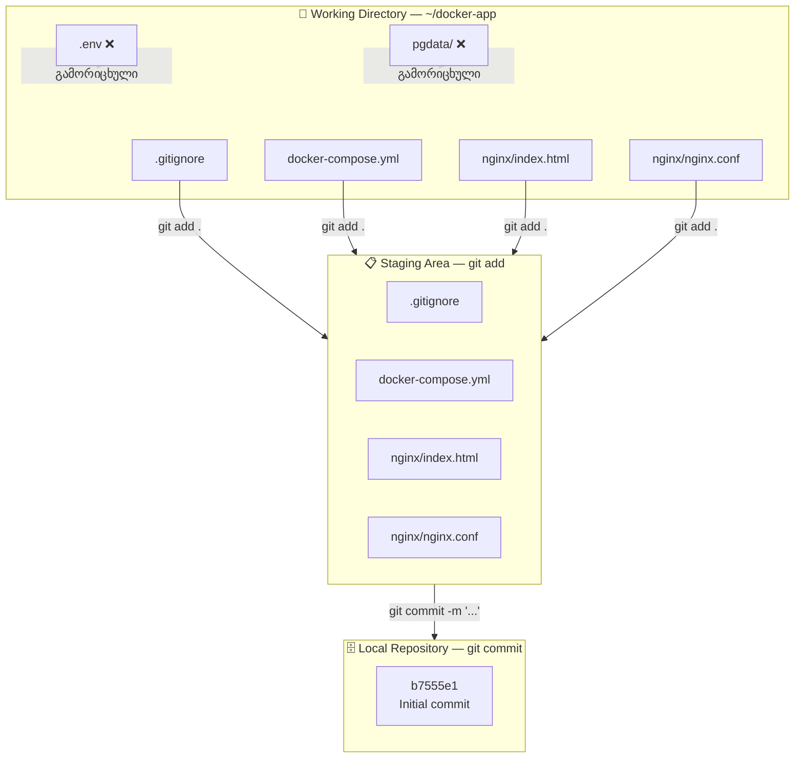

Task 18 — Git Repository Setup


## არქიტექტურა




## Git-ის გლობალური კონფიგურაცია

ეს პარამეტრები ერთხელ დაყენდება და ყველა რეპოზიტორიაში გამოიყენება:

```bash
git config --global user.name "kapanadze"
git config --global user.email "kapan.gio777@gmail.com"
git config --global init.defaultBranch main
```

| პარამეტრი | დანიშნულება |
|-----------|-------------|
| `user.name` | commit-ებში ავტორის სახელი |
| `user.email` | commit-ებში ავტორის ელფოსტა |
| `init.defaultBranch main` | ახალი repo-ს default branch იქნება `main` (არა `master`) |

> 💡 `init.defaultBranch` პარამეტრი Git 2.28-ში დაემატა. თანამედროვე პრაქტიკით `main` სახელი სტანდარტია (GitHub, GitLab ორივე ამას იყენებს).

```console
k@devserver:~/docker-app$ git config --global user.name "kapanadze"
k@devserver:~/docker-app$ git config --global user.email "kapan.gio777@gmail.com"
k@devserver:~/docker-app$ cd ~/docker-app
k@devserver:~/docker-app$ git init
hint: Using 'master' as the name for the initial branch. This default branch name
hint: is subject to change. To configure the initial branch name to use in all
hint: of your new repositories, which will suppress this warning, call:
hint:
hint:   git config --global init.defaultBranch <name>
hint:
hint: Names commonly chosen instead of 'master' are 'main', 'trunk' and
hint: 'development'. The just-created branch can be renamed via this command:
hint:
hint:   git branch -m <name>
Initialized empty Git repository in /home/k/docker-app/.git/


git config --global init.defaultBranch main
```


## რეპოზიტორიის ინიციალიზაცია

```bash
cd ~/docker-app
git init
```

```
Initialized empty Git repository in /home/k/docker-app/.git/
```

`git init` ქმნის `.git/` დირექტორიას პროექტის ფოლდერში — აქ ინახება Git-ის მთელი ისტორია, branch-ები, კონფიგურაცია. ეს დირექტორია არ უნდა წაიშალოს და არ უნდა შეიცვალოს ხელით.


## .gitignore შექმნა

ყველა ფაილი არ უნდა მოხვდეს version control-ში. `.gitignore` განსაზღვრავს რომელი ფაილები/დირექტორიები გამოირიცხოს:

```bash
nano .gitignore
```

```console
.env
*.log
pgdata/
```

| Pattern | რას გამორიცხავს | რატომ |
|---------|-----------------|-------|
| `.env` | Environment variables ფაილი | შეიძლება პაროლები და API key-ები შეიცავდეს |
| `*.log` | ნებისმიერი `.log` ფაილი | ლოგები დროებითი მონაცემებია, repo-ში არ უნდა იყოს |
| `pgdata/` | PostgreSQL-ის მონაცემთა დირექტორია | ბინარული მონაცემები, ზომით დიდი, და Docker volume-ით იმართება |

> 💡 `.gitignore` ფაილი თავად უნდა იყოს commit-ში — ის პროექტის ნაწილია და გუნდის ყველა წევრს ერთნაირად მოქმედებს.


## ფაილების დამატება და Initial Commit

### Staging (git add)

```bash
git add .
git status
```

```
On branch master

No commits yet

Changes to be committed:
        new file:   .gitignore
        new file:   docker-compose.yml
        new file:   nginx/index.html
        new file:   nginx/nginx.conf
```

`git add .` ყველა ფაილს (`.gitignore`-ით გამორიცხულის გარდა) staging area-ში ამატებს. `git status` გვიჩვენებს რა ელოდება commit-ს.

### Commit

```bash
git commit -m "Initial commit: Nginx + PostgreSQL + Adminer docker-compose app"
```

```
[master (root-commit) b7555e1] Initial commit: Nginx + PostgreSQL + Adminer docker-compose app
 4 files changed, 147 insertions(+)
 create mode 100644 .gitignore
 create mode 100644 docker-compose.yml
 create mode 100644 nginx/index.html
 create mode 100644 nginx/nginx.conf
```

---

## 5. შემოწმება

### Commit-ის ისტორია

```bash
git log
```

```
commit b7555e19618a377c98b79c7203013bb54095725a (HEAD -> master)
Author: kapanadze <kapan.gio777@gmail.com>
Date:   Tue Feb 10 19:46:32 2026 +0000

    Initial commit: Nginx + PostgreSQL + Adminer docker-compose app
```

### Repo-ში არსებული ფაილები

```bash
git ls-files
```

```
.gitignore
docker-compose.yml
nginx/index.html
nginx/nginx.conf
```

> ✅ 4 ფაილი — `.env`, `*.log`, და `pgdata/` სწორად გამოირიცხა `.gitignore`-ით.


```console
ფაილების დამატება და initial commit:
bashgit add .
git status
git commit -m "Initial commit: Nginx + PostgreSQL + Adminer docker-compose app"

k@devserver:~/docker-app$ git add .
k@devserver:~/docker-app$ git status
On branch master

No commits yet

Changes to be committed:
  (use "git rm --cached <file>..." to unstage)
        new file:   .gitignore
        new file:   docker-compose.yml
        new file:   nginx/index.html
        new file:   nginx/nginx.conf

k@devserver:~/docker-app$ git commit -m "Initial commit: Nginx + PostgreSQL + Adminer docker-compose app"
[master (root-commit) b7555e1] Initial commit: Nginx + PostgreSQL + Adminer docker-compose app
 4 files changed, 147 insertions(+)
 create mode 100644 .gitignore
 create mode 100644 docker-compose.yml
 create mode 100644 nginx/index.html
 create mode 100644 nginx/nginx.conf

შემოწმება:
```
```bash
git log
```
```console
k@devserver:~/docker-app$ git log
commit b7555e19618a377c98b79c7203013bb54095725a (HEAD -> master)
Author: kapanadze <kapan.gio777@gmail.com>
Date:   Tue Feb 10 19:46:32 2026 +0000

    Initial commit: Nginx + PostgreSQL + Adminer docker-compose app

```
დაინახავ:
```console
commit abc123... (HEAD -> master)
Author: Kapo <your@email.com>
Date:   Tue Feb 10 ...

    Initial commit: Nginx + PostgreSQL + Adminer docker-compose app
6. რა ფაილებია repo-ში:
bashgit ls-files
```

```console

.gitignore
docker-compose.yml
nginx/index.html
nginx/nginx.conf

k@devserver:~/docker-app$ git ls-files
.gitignore
docker-compose.yml
nginx/index.html
nginx/nginx.conf
```


## შედეგები

### Git-ის სამი ზონა

Git-ში ფაილები სამ ზონას შორის მოძრაობს:

**Working Directory** → `git add` → **Staging Area** → `git commit` → **Repository**

Working Directory არის ის, რასაც ფაილ სისტემაში ხედავ. `git add` ამზადებს ცვლილებებს commit-ისთვის (staging). `git commit` კი საბოლოოდ ინახავს snapshot-ს ისტორიაში.

### .gitignore-ის მნიშვნელობა

სენსიტიური მონაცემები (პაროლები, API keys), ბინარული ფაილები (database data), და დროებითი ფაილები (logs) არ უნდა მოხვდეს Git-ის ისტორიაში. ერთხელ commit-ში მოხვედრილი პაროლი ისტორიიდან ძალიან ძნელია ამოსაშლელი — ამიტომ `.gitignore` პროექტის დასაწყისშივე უნდა შეიქმნას.

### Commit Messages

კარგი commit message მოკლედ და ზუსტად აღწერს რა შეიცვალა. Initial commit-ისთვის პროექტის შემადგენლობის აღწერა სწორი მიდგომაა. მომავალში commit-ები უფრო კონკრეტულ ცვლილებებს უნდა აღწერდეს, მაგალითად: `"Add health check endpoint"`, `"Fix adminer proxy path"`.