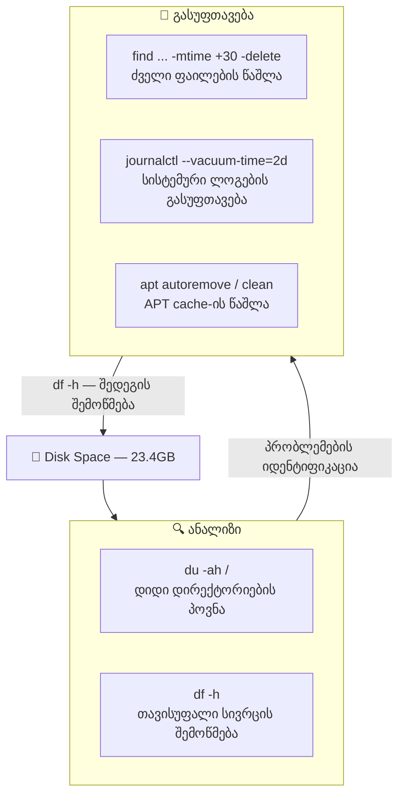

Task 21 — Disk Space Management


## არქიტექტურა




## დისკის მოხმარების ანალიზი

### ტოპ 10 ყველაზე დიდი დირექტორია/ფაილი

ყველაზე დიდი დირექტორიების პოვნა
სანამ რამეს წაშლი, უნდა გაარკვიო, სად არის "დამალული" დიდი მოცულობის ფაილები. ამისთვის გამოიყენება du (Disk Usage) ბრძანება.

```bash
sudo du -ah / | sort -rh | head -n 10
```

| ფლაგი | დანიშნულება |
|-------|-------------|
| `-a` | ყველა ფაილი და დირექტორია (არამხოლოდ დირექტორიები) |
| `-h` | ადამიანისთვის გასაგები ფორმატი (GB, MB, KB) |
| `sort -rh` | დახარისხება ზომის მიხედვით, დიდიდან პატარისკენ |
| `head -n 10` | მხოლოდ პირველი 10 შედეგი |

```
9.6G    /
4.1G    /swap.img
3.7G    /usr
2.1G    /usr/lib
1.8G    /var
1.4G    /var/lib
606M    /var/lib/containerd
557M    /usr/lib/firmware
556M    /usr/libexec
497M    /var/lib/docker
```

### რას გვეუბნება ეს მონაცემები

სერვერის 23.4GB დისკიდან 9.6GB არის გამოყენებული. აი როგორ ნაწილდება:

| რა | ზომა | განმარტება |
|----|------|-----------|
| `/swap.img` | 4.1G | Swap ფაილი — RAM-ის „გაფართოება" დისკზე |
| `/usr/lib` | 2.1G | სისტემური ბიბლიოთეკები და პაკეტები |
| `/var/lib/containerd` | 606M | Docker container runtime-ის მონაცემები |
| `/usr/lib/firmware` | 557M | Hardware firmware ფაილები |
| `/var/lib/docker` | 497M | Docker images, volumes, layers |

> 💡 `/proc/...` შეცდომები ნორმალურია — ეს ვირტუალური ფაილური სისტემაა და პროცესები იცვლება `du`-ს მუშაობის დროს.

ყველაზე დიდი დირექტორიების მოცულობა
```console
k@devserver:~$ sudo du -ah / | sort -rh | head -n 10
du: cannot access '/proc/147776/task/148287/fd/120': No such file or directory
du: cannot access '/proc/147776/task/148287/fdinfo/122': No such file or directory
du: cannot access '/proc/147776/task/148298/fd/133': No such file or directory
du: cannot access '/proc/158262/task/158262/fd/4': No such file or directory
du: cannot access '/proc/158262/task/158262/fdinfo/4': No such file or directory
du: cannot access '/proc/158262/fd/3': No such file or directory
du: cannot access '/proc/158262/fdinfo/3': No such file or directory
du: cannot access '/proc/158332': No such file or directory
9.6G    /
4.1G    /swap.img
3.7G    /usr
2.1G    /usr/lib
1.8G    /var
1.4G    /var/lib
606M    /var/lib/containerd
557M    /usr/lib/firmware
556M    /usr/libexec
497M    /var/lib/docker
```


## ძველი ფაილების პოვნა და წაშლა

### ჯერ ნახვა (უსაფრთხოებისთვის)

```bash
sudo find /var/log -type f -mtime +30
```

```
/var/log/bootstrap.log
/var/log/btmp
/var/log/faillog
/var/log/landscape/sysinfo.log
```

| ფლაგი | დანიშნულება |
|-------|-------------|
| `-type f` | მხოლოდ ფაილები (არა დირექტორიები) |
| `-mtime +30` | ფაილები რომლებიც 30 დღეზე მეტია არ შეცვლილა |

### შემდეგ წაშლა

```bash
sudo find /var/log -type f -mtime +30 -delete
```

> ⚠️ **ყოველთვის ჯერ `-delete`-ის გარეშე გაუშვით** რომ ნახოთ რა წაიშლება. `-delete` ფლაგი შეუქცევადია — Recycle Bin არ არსებობს.

```console
k@devserver:~$ sudo find /var/log -type f -mtime +30
/var/log/bootstrap.log
/var/log/btmp
/var/log/faillog
/var/log/landscape/sysinfo.log
```

```bash
sudo find /var/log -type f -mtime +30 -delete
```

## სისტემური ლოგების (Journald) გასუფთავება

systemd-journald არის Ubuntu-ს ლოგირების სისტემა. დროთა განმავლობაში ლოგები დიდ ადგილს იკავებს.

### დროის მიხედვით

```bash
sudo journalctl --vacuum-time=2d
```

ტოვებს მხოლოდ ბოლო 2 დღის ლოგებს, დანარჩენს შლის.

### ზომის მიხედვით

```bash
sudo journalctl --vacuum-size=500M
```

ლოგებს ამცირებს 500MB-მდე, ძველიდან იწყებს წაშლას.

> 💡 ლოგების მიმდინარე ზომის სანახავად: `journalctl --disk-usage`

---


## APT Cache-ის გასუფთავება

პაკეტების ინსტალაციის შემდეგ `.deb` ფაილები cache-ში რჩება. ასევე, dependency-ად დაინსტალირებული პაკეტები შეიძლება აღარ იყოს საჭირო.

```bash
sudo apt-get autoremove    # გამოუყენებელი პაკეტების წაშლა
sudo apt-get clean         # გადმოწერილი .deb ფაილების წაშლა
```

| ბრძანება | რას აკეთებს |
|----------|-------------|
| `autoremove` | შლის პაკეტებს რომლებიც სხვა პაკეტის dependency-ად დაინსტალირდა და აღარ არის საჭირო |
| `clean` | შლის `/var/cache/apt/archives/`-დან ყველა გადმოწერილ `.deb` ფაილს |

> 💡 `apt-get autoclean` — `clean`-ის „რბილი" ვერსია: შლის მხოლოდ მოძველებულ `.deb` ფაილებს, აქტუალურს ტოვებს.

---


## შედეგის შემოწმება

```bash
df -h
```

| ფლაგი | დანიშნულება |
|-------|-------------|
| `-h` | ადამიანისთვის გასაგები ფორმატი |

`df` აჩვენებს თითოეული mounted ფაილური სისტემის სრულ/გამოყენებულ/თავისუფალ სივრცეს.

---

## სასარგებლო ბრძანებების შეჯამება

| ამოცანა | ბრძანება |
|---------|----------|
| თავისუფალი სივრცე | `df -h` |
| დიდი დირექტორიების პოვნა | `sudo du -ah / \| sort -rh \| head -n 10` |
| კონკრეტული დირექტორიის ზომა | `du -sh /var/log` |
| ძველი ფაილების პოვნა | `sudo find /path -type f -mtime +30` |
| ძველი ფაილების წაშლა | `sudo find /path -type f -mtime +30 -delete` |
| ლოგების გასუფთავება (დრო) | `sudo journalctl --vacuum-time=2d` |
| ლოგების გასუფთავება (ზომა) | `sudo journalctl --vacuum-size=500M` |
| ლოგების ზომის ნახვა | `journalctl --disk-usage` |
| APT cache წაშლა | `sudo apt-get clean` |
| გამოუყენებელი პაკეტები | `sudo apt-get autoremove` |

---

## საბოლოოდ

### „ჯერ ნახე, მერე წაშალე" პრინციპი

Linux-ში წაშლა შეუქცევადია. `find ... -delete`, `rm -rf` — არცერთს Recycle Bin არ აქვს. ამიტომ ყოველთვის ორ ნაბიჯად ვმოქმედებთ: ჯერ ვნახულობთ რა წაიშლება, შემდეგ ვშლით.

### Swap ფაილი

ჩვენს სერვერზე ყველაზე დიდი ფაილი `/swap.img` (4.1GB) არის. Swap არის დისკის ნაწილი რომელსაც სისტემა RAM-ის ნაცვლად იყენებს როცა მეხსიერება არ ყოფნის. 7.76GB RAM-ით და 9.8% მოხმარებით swap-ი ფაქტიურად არ გამოიყენება, მაგრამ მისი წაშლა რეკომენდებული არ არის.

### პროაქტიული vs რეაქტიული მენეჯმენტი

ამ Task-ში ხელით გავწმინდეთ დისკი. პროდაქშენ სერვერზე ეს ავტომატიზებული უნდა იყოს — მაგალითად cron job-ით რომელიც ძველ ლოგებს პერიოდულად წაშლის, ან logrotate-ით რომელიც ლოგ ფაილების ზომას აკონტროლებს. Netdata-ს (Task 20) შეუძლია alert-ის გაგზავნა როცა დისკის მოცულობა კრიტიკულ ზღვარს მიუახლოვდება.